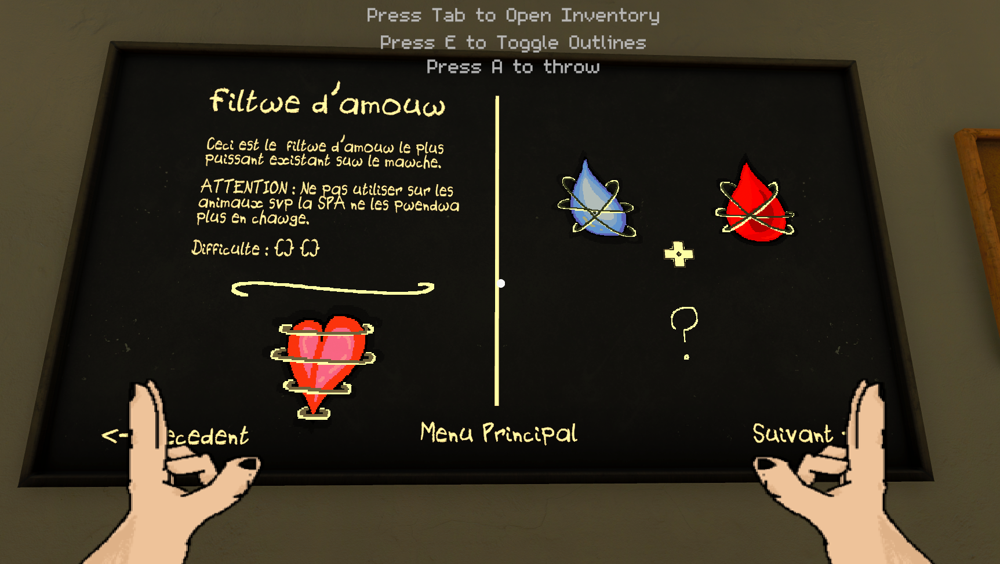
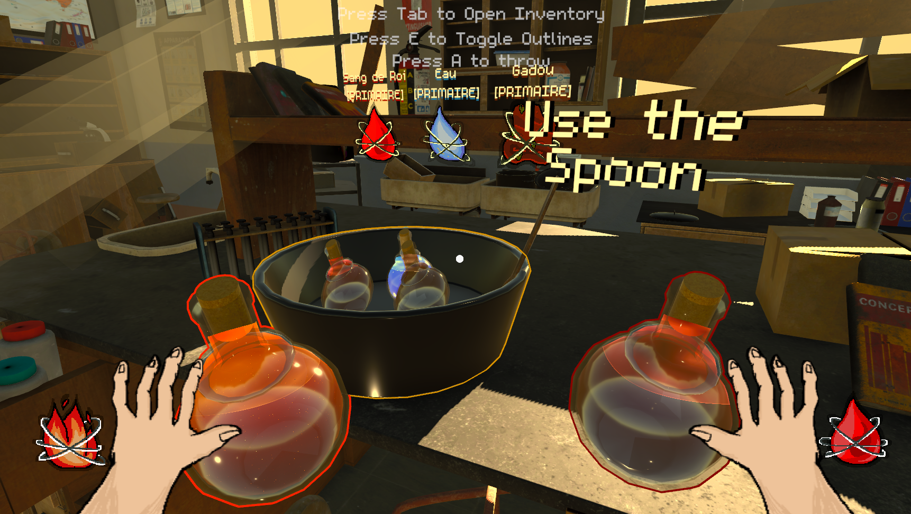
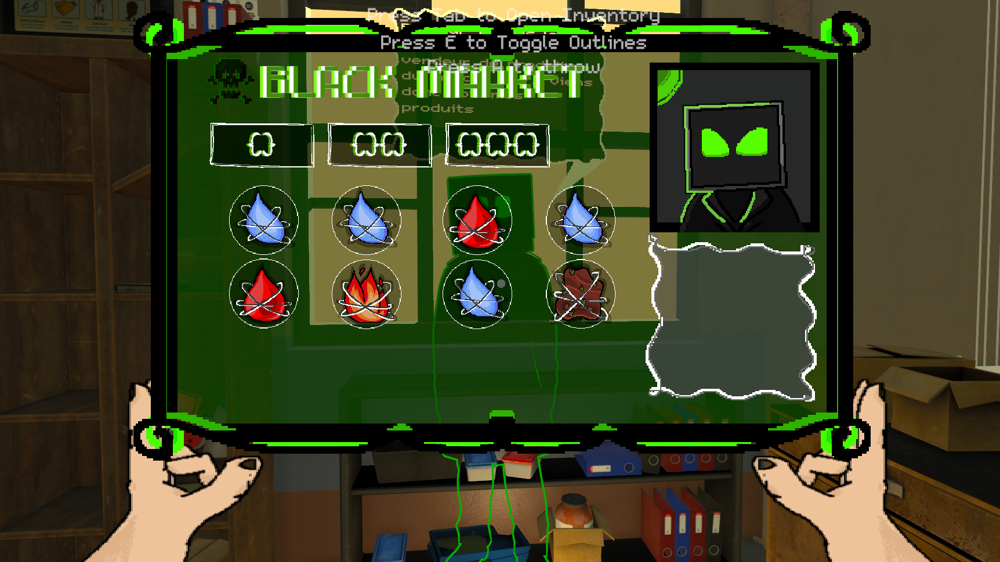
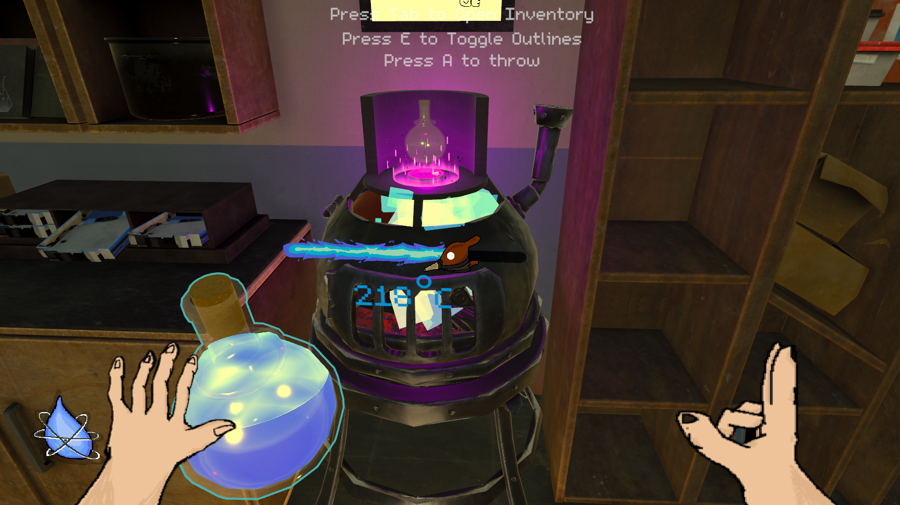

# The Tarnished Alchemist
*The Tarnished Alchemist* est le resultat d'un projet de 2 semaines sur l'**UI** dans Unity.   
J'ai eu affaire a de l'UI en *World Spac*e et en *Screen Space*, beaucoup de *Raycast* et biensur du design ergonomique histoire que ca rende bien (meme en terme de responsive).   
Vous pouvez tester le projet sur ***[Itch.io](https://pages.github.com/).*** (N'hesitez pas a aller regarder mes autres projets)
## Livre de Recettes
J'ai decidé de partir sur une DA de classe de chimie avec des potions et un UI completement homemade.   
Tout l'art et les animations ont été a la main sur Aseprite.

## Chaudron 

## Black Market

## Furnace

